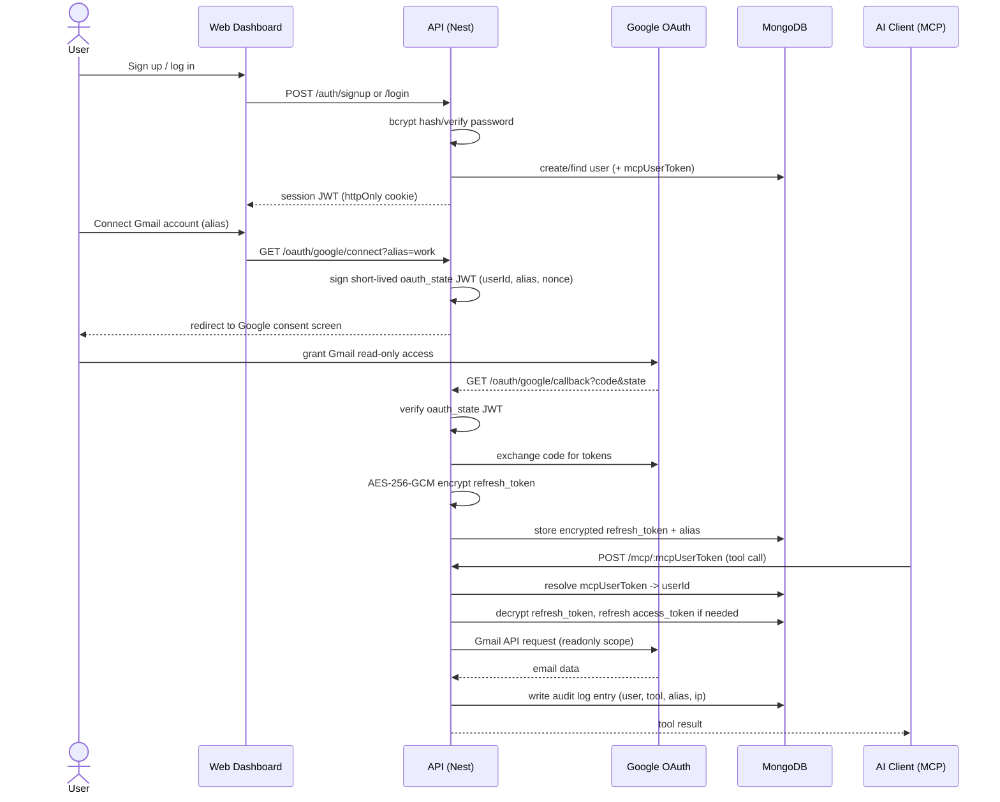

<p align="center">
  
</p>

<h1 align="center">Hubmail</h1>

<p align="center">
  <a href="LICENSE"></a>
  
  
  =20" />
</p>

Multi-account Gmail MCP server. Connect one or more Gmail accounts, then let any [MCP](https://modelcontextprotocol.io)-compatible AI client (Claude, etc.) search and read your email through a small set of audited tools.

## How it works

- Sign up / log in via the built-in web dashboard (React + Vite frontend served by the API).
- Connect one or more Gmail accounts via Google OAuth. Each account gets a short alias (e.g. `work`, `personal`).
- The dashboard gives you a personal **MCP connector URL**: `PUBLIC_BASE_URL/mcp/<your-token>`.
- Add that URL as an MCP server in Claude Desktop, Claude Code, or any other MCP client.
- The assistant can then call `list_accounts`, `search_emails`, and `read_email` against your connected Gmail accounts.
- Every tool call is written to a per-user audit log (visible via `GET /auth/audit-logs`), so you can see exactly what was searched or read and when.

## Tech stack

- **API**: NestJS 11, MongoDB (Mongoose), Google APIs (`googleapis`), JWT session cookies, Helmet, rate limiting (`@nestjs/throttler`)
- **MCP**: `@modelcontextprotocol/sdk`, Streamable HTTP transport at `POST /mcp/:userToken`
- **Web**: React 19, Vite, TypeScript

## MCP tools exposed

| Tool | Description |
|---|---|
| `list_accounts` | Lists the Gmail account aliases connected for the authenticated user. |
| `search_emails` | Searches a connected account using Gmail search syntax (`from:`, `subject:`, etc). |
| `read_email` | Fetches the full body and attachment list of a single email by message id. |
| `delete_email` | Moves a single email to Trash by message id. Recoverable — not a permanent delete. Requires write access. |
| `draft_email` | Creates a draft (to/subject/body) in a connected account. Does not send it. Requires write access. |
| `create_label` | Creates a Gmail label. Idempotent — returns the existing label if the name already exists. Requires write access. |
| `label_email` | Tags one or more emails with an existing label by message id. Emails stay in Inbox. Requires write access. |
| `move_email_to_label` | Tags one or more emails with an existing label and archives them (removes INBOX), like moving mail into a folder. Requires write access. |
| `create_mail_filter` | Creates a Gmail filter so future mail matching a search query is auto-labeled (and optionally skips Inbox). Applies only to mail that arrives after creation, not existing mail. Requires write access. |

**Read vs. write access**: connecting an account requests both `gmail.readonly` and `gmail.modify`. Google's consent screen lets the user deselect `gmail.modify` and keep the connection read-only — `search_emails`/`read_email`/`list_accounts` keep working, the write tools (`delete_email`, `draft_email`, `create_label`, `label_email`, `move_email_to_label`, `create_mail_filter`) fail with a clear "reconnect and grant write access" message until the account is reconnected with `gmail.modify` granted.

## Prerequisites

- Node.js
- MongoDB running locally or reachable via `MONGODB_URI`
- A Google Cloud project with a configured OAuth 2.0 Client ID (Gmail API enabled)

## Setup

```bash
npm install
npm --prefix web install
cp .env.example .env   # fill in the values below
```

Environment variables (`.env`):

| Variable | Purpose |
|---|---|
| `PORT` | Port the API listens on (default `3000`) |
| `MONGODB_URI` | MongoDB connection string |
| `GOOGLE_CLIENT_ID` / `GOOGLE_CLIENT_SECRET` | Google OAuth 2.0 credentials |
| `GOOGLE_REDIRECT_URI` | Must exactly match the redirect URI configured on the Google OAuth client |
| `PUBLIC_BASE_URL` | Public base URL of this server, used to build each user's `/mcp/:userToken` connector URL |
| `CLIENT_URL` | Optional. Dashboard origin for OAuth redirects when the web SPA runs on a separate dev port. Falls back to `PUBLIC_BASE_URL`; leave unset in production |
| `TOKEN_ENCRYPTION_KEY` | 32-byte hex key for encrypting stored Gmail OAuth tokens (`openssl rand -hex 32`) |
| `JWT_SECRET` | Secret used to sign session JWTs |

## Running

```bash
# API only, watch mode
npm run start:dev

# Web dashboard, dev server
npm --prefix web run dev

# Production: build both and serve the web bundle from the API
npm run build
npm run web:build
npm run start:prod
```

The API serves the built web dashboard as static files (excluding `/auth`, `/oauth`, and `/mcp` routes), so a production deployment only needs the Nest server running.

## Docker

Build and publish a multi-platform image (`linux/amd64` + `linux/arm64`) with `docker buildx`. A plain `docker build` on an Apple Silicon Mac only produces an `arm64` image — it won't run on a typical `amd64` Linux host, which is why `buildx` (not a plain build) is the right tool here.

```bash
docker login

# one-off: create a builder that can target multiple platforms (skip if you already have one)
docker buildx create --name hubmail-builder --use

IMAGE=<your-dockerhub-user>/<your-image-name>

docker buildx build \
  --platform linux/amd64,linux/arm64 \
  -t $IMAGE:latest \
  -t $IMAGE:$(node -p "require('./package.json').version") \
  --push \
  .
```

`--push` publishes each platform's image directly to Docker Hub as part of the build — `buildx` can't `--load` a multi-platform build into the local Docker daemon (only single-platform images can be loaded locally), so pushing in the same step is the standard way to do this, rather than building then pushing separately.

If you only need a single-arch image for the machine you're building on, a plain `docker build -t anandudevops/hubmail:latest .` still works — but push a multi-arch image with `buildx` if the image needs to run on a different architecture than your build machine.

### Run locally from source

To run your current code changes in Docker (not the image pulled from Docker Hub):

```bash
docker build -t hubmail:local .

docker run --rm \
  --env-file .env \
  -p 5001:5001 \
  --name hubmail \
  hubmail:local
```

Tag it `hubmail:local` so it doesn't collide with a pulled `<user>/hubmail` image. `-p` must match `PORT` in your `.env` — the container listens on whatever `PORT` it's given via `--env-file`. Rebuild (`docker build ...` again) after every code change; the image won't reflect edits on its own.

## Deployment

`.github/workflows/deploy.yml` builds this project on every push to `main`, pushes the image to GitHub Container Registry (`ghcr.io/anandukch/hubmail:latest`), then SSHes into a DigitalOcean droplet and restarts it via `docker compose`.

One-time droplet setup (before the first deploy):

```bash
mkdir -p /opt/hubmail
# then create /opt/hubmail/.env on the droplet with production values
# (see the env var table above — PORT, MONGODB_URI, GOOGLE_CLIENT_ID/SECRET, etc.)
# set PUBLIC_BASE_URL=https://hubmail.anandu.xyz and GOOGLE_REDIRECT_URI accordingly
```

`docker-compose.yml` (repo root) is what gets copied to `/opt/hubmail/docker-compose.yml` and run there — it pulls `ghcr.io/anandukch/hubmail:latest`, reads `/opt/hubmail/.env`, and exposes port `3000`.

**Nginx + TLS**: `config/nginx-hubmail.conf` reverse-proxies `hubmail.anandu.xyz` (port 80/443) to the container's `localhost:3000`. One-time setup on the droplet:

```bash
sudo cp config/nginx-hubmail.conf /etc/nginx/sites-available/hubmail.anandu.xyz
sudo ln -s /etc/nginx/sites-available/hubmail.anandu.xyz /etc/nginx/sites-enabled/
sudo nginx -t && sudo systemctl reload nginx
sudo certbot --nginx -d hubmail.anandu.xyz
```

Required GitHub repo secrets: `DO_HOST`, `DO_USER`, `DO_SSH_PRIVATE_KEY`.

## Connecting an MCP client

1. Log in to the dashboard and connect a Gmail account.
2. Copy the connector URL shown on the dashboard (`PUBLIC_BASE_URL/mcp/<token>`).
3. Add it to your client's MCP config.

**Claude Desktop** (`claude_desktop_config.json`) and **Claude Code** (`.mcp.json`) only support local stdio server entries (`command`/`args`) in their config files — a bare `"url"`/`"type": "http"` entry gets silently rejected as invalid. For a remote HTTP server like this one, bridge it through [`mcp-remote`](https://www.npmjs.com/package/mcp-remote):

```json
{
  "mcpServers": {
    "hubmail": {
      "command": "npx",
      "args": ["-y", "mcp-remote", "https://your-domain.example/mcp/<your-mcp-user-token>"]
    }
  }
}
```

Fully quit and reopen the client after editing — the config is only read at launch.

Adding the URL directly through Settings → Connectors → "Add custom connector" instead will get stuck on "not connected" — that flow expects the server to implement an OAuth authorization handshake, which this server doesn't (it only does Google OAuth, for Gmail access itself). The `mcp-remote` route above bypasses that entirely.

## Security

- **Passwords**: hashed with bcrypt, never stored in plaintext.
- **Sessions**: signed JWT (`typ: session`) in an `httpOnly`, `sameSite=lax` cookie; `secure` in production.
- **OAuth CSRF protection**: the Google OAuth `state` param is itself a short-lived (5 min) signed JWT (`typ: oauth_state`) carrying `userId` + `alias` + a random nonce, verified on callback.
- **Gmail refresh tokens**: encrypted at rest with AES-256-GCM (`TOKEN_ENCRYPTION_KEY`) before being written to MongoDB; access tokens are cached and refreshed on demand.
- **MCP access**: each user gets an unguessable, random per-user token (`mcpUserToken`, 32 random bytes) baked into their connector URL (`/mcp/:userToken`) instead of a login flow — anyone with the URL can call the tools, so treat it like a password.
- **Every MCP tool call is audit-logged** (user, tool, account alias, IP, timestamp) and retrievable via `GET /auth/audit-logs`.
- **Transport hardening**: Helmet security headers on every response, per-route rate limiting (`@nestjs/throttler`) on auth and OAuth endpoints.



## Testing

```bash
npm test          # unit tests
npm run test:e2e  # end-to-end tests
npm run lint       # ESLint (API) / oxlint (web)
```

## Verifying Gmail credentials

```bash
npm run verify:gmail
```
